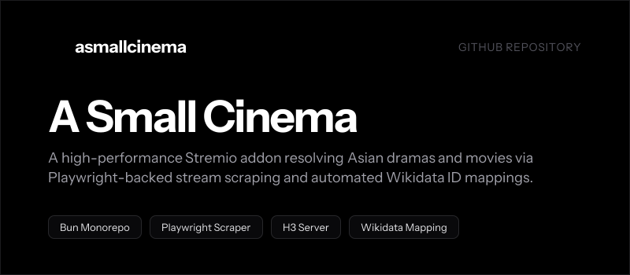

# A Small Cinema

<p align="center">
  
</p>

## Overview

**A Small Cinema** is a high-performance Stremio addon monorepo tailored for resolving Asian drama and movie streams. It leverages Playwright for dynamic browser-based scraping and provides robust Wikidata ID mapping.

## Monorepo Workspaces

The project is managed as a Bun monorepo divided into two distinct workspaces:

* **[apps/asmallcinema](file:///Users/bachnx/Projects/asmallcinema/apps/asmallcinema)**: Core Stremio addon service built with H3, Playwright, and TypeScript.
* **[apps/docs](file:///Users/bachnx/Projects/asmallcinema/apps/docs)**: Documentation website built with Vite, React, TypeScript, and UnoCSS.
* **[tools/bannergen](file:///Users/bachnx/Projects/asmallcinema/tools/bannergen)**: Brand banner generator utilizing Vercel Satori and Resvg.

---

## Development Guide

### Prerequisites

You need [Bun](https://bun.sh) installed globally.

### 1. Install Dependencies

Install all dependencies and link workspaces from the root folder:

```bash
bun install
```

### 2. Run the Addon Service

Run the Stremio addon server in watch/development mode:

```bash
bun --filter asmallcinema dev
```
By default, the server starts on `http://localhost:3005`. The addon manifest endpoint is:
`http://localhost:3005/manifest.json`

### 3. Run the Documentation App

Launch the documentation Vite development server:

```bash
bun --filter docs dev
```
The documentation SPA will be available at `http://localhost:5173`.

---

## Production Build

### Build the Documentation

To build static production assets for the documentation app:

```bash
bun --filter docs build
```
The output will compile into `apps/docs/dist`.

---

## Utility Tools

### Regenerate README Banner

You can regenerate the custom high-resolution banner image using the Satori tool:

```bash
bun --filter bannergen generate
```

---

## Deployments

A GitHub Actions workflow is configured in [.github/workflows/deploy-docs.yml](file:///Users/bachnx/Projects/asmallcinema/.github/workflows/deploy-docs.yml) to automatically build and host the documentation on GitHub Pages whenever modifications are pushed to the `main` branch.

## License

This project is licensed under the [MIT License](file:///Users/bachnx/Projects/asmallcinema/LICENSE).
